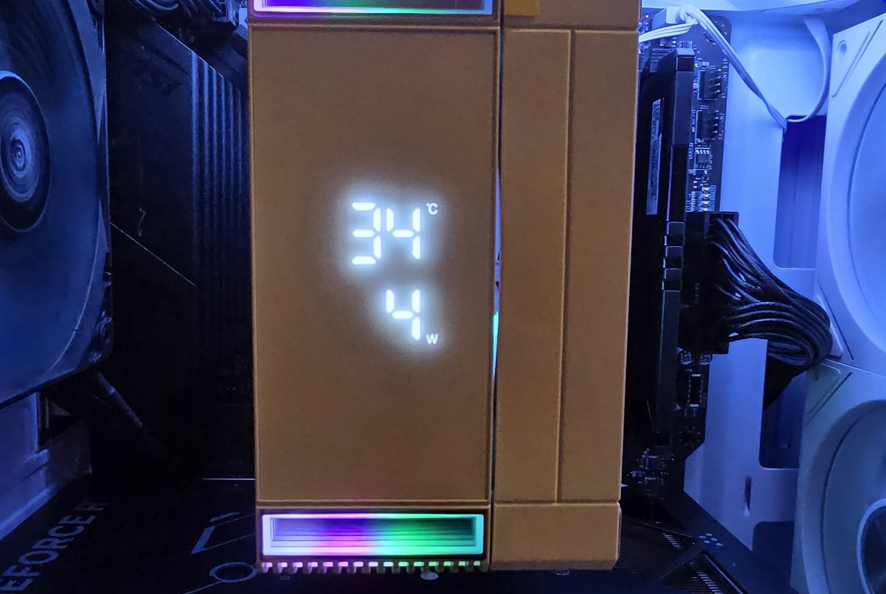

# Rise Mode Cooler Linux Monitor

A custom Linux driver and monitoring service for the Rise Mode hardware display (HID 1a2c:4984). This project bypasses the proprietary Windows-only driver, allowing you to display real-time CPU temperature and usage stats on your hardware's 7-segment display under Linux.

Tested with the model Rise Mode Temp 6 White




## Technical Overview
The display communicates via a 65-byte HID packet stream. It utilizes a custom initialization handshake (0x07, 0xFD) followed by a precise 7-segment digit-mapping format that prevents hardware rejection by observing specific flags and padding requirements. Due to the device's nature as an uninitialized USB interface, this service runs with elevated I/O capabilities (CAP_SYS_RAWIO) to target the specific USB port path directly.

## Disabling Auto-Driver Download
The device may attempt to run a script at boot to download its standard Windows driver. To prevent this from happening, blacklist the identifier:
```bash
sudo nano /etc/modprobe.d/blacklist-cooler.conf
```
add: 
```bash
options usbhid quirks=0x1a2c:0x4984:0x04
```
```bash
sudo update-initramfs -u
```

## Prerequisites
- OS: Ubuntu 24.04 LTS (or similar Linux distribution) (Tested on Ubuntu 26.04 LTS)
- Dependencies: psutil, hidapi


## Installation


### 1. Install Dependencies
```bash
sudo apt update
sudo apt install python3-pip
pip3 install psutil hidapi
```


### 2. Deploy Script
Move the script to a system directory:
```bash
sudo mkdir -p /opt/cooler-monitor
sudo cp cooler_monitor.py /opt/cooler-monitor/
```


### 3. Deploy the Service
1. Create the service file: 
```bash
sudo nano /etc/systemd/system/cooler-monitor.service
```
2. Paste the following configuration:

```ini
[Unit]
Description=Rise Mode Cooler Hardware Monitor
After=network.target

[Service]
CapabilityBoundingSet=CAP_SYS_RAWIO
AmbientCapabilities=CAP_SYS_RAWIO

Type=simple
User=root
Group=root
ExecStart=/usr/bin/python3 /opt/cooler-monitor/cooler_monitor.py
WorkingDirectory=/opt/cooler-monitor/
Restart=always
RestartSec=10
Environment=PYTHONUNBUFFERED=1

[Install]
WantedBy=multi-user.target
```
3. Reload and enable:
 ``bash
sudo systectl dYeload-reload
sudo systectl enable cooler-monitor
sudo systectl start cooler-monitor
```


## Usage
Once enabled, the service runs automatically in the background. You can manage it using standard systemd commands:
* Check status: sudo systectl status cooler-monitor
* View logs: journalctl -u cooler-monitor -f
* Restart: sudo systectl restart cooler-monitor

## Troubleshooting
If the display fails to connect, verify the device path using `lsusb -s`. If your device is not on 1-2.4, update the paths list in cooler_monitor.py to match the path reported by your system.

## License
This project is open-source and intended for non-commercial hardware interoperability.
